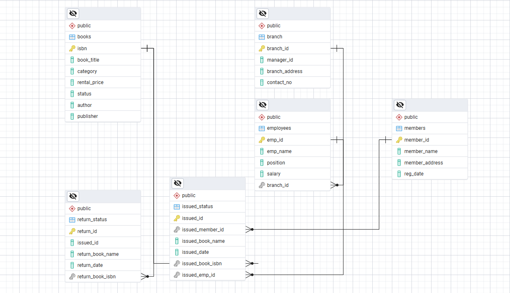
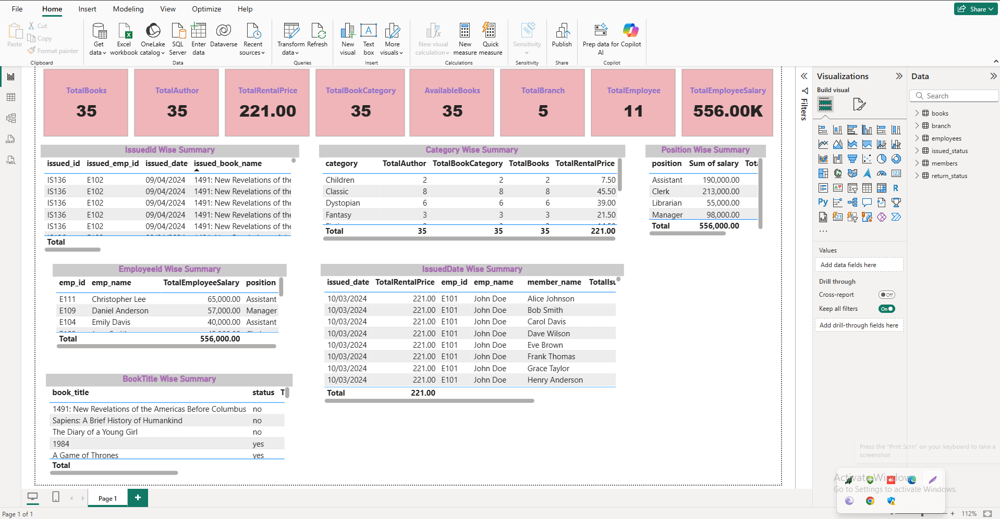

# 📚 Practice SQL Queries on Library Management System

## 📌 Project Overview
This project is designed to **practice SQL queries** using a Library Management System (LMS) database.  
It simulates the core operations of a library such as managing **branches, employees, members, books, issuing, and returning of books**.  

The main purpose is to provide a hands-on environment to learn and improve SQL skills including:
- Creating and managing tables
- Inserting, updating, and deleting records
- Writing queries with **joins, subqueries, aggregate functions**

 

## 🏗 Database Schema
The system includes the following tables:

1. **Branch** – Stores branch information (ID, address, contact).
2. **Employees** – Stores employees working at different branches.
3. **Members** – Stores library member details.
4. **Books** – Stores book details including ISBN, title, author, and publisher.
5. **Issued_Status** – Tracks issued books with issue date, member, and employee details.
6. **Return_Status** – Tracks returned books with return date.

## 🏗 Table Relation

 

 ## 🏗 Data visualization and data analysis 
 
  

  ## 🏗 Table Data Creation 
  Created tables for branches, employees, members, books, issued status, and return status. Each table includes relevant columns and relationships.

```sql
CREATE DATABASE library_db;

DROP TABLE IF EXISTS branch;
CREATE TABLE branch
(
            branch_id VARCHAR(10) PRIMARY KEY,
            manager_id VARCHAR(10),
            branch_address VARCHAR(30),
            contact_no VARCHAR(15)
);


-- Create table "Employee"
DROP TABLE IF EXISTS employees;
CREATE TABLE employees
(
            emp_id VARCHAR(10) PRIMARY KEY,
            emp_name VARCHAR(30),
            position VARCHAR(30),
            salary DECIMAL(10,2),
            branch_id VARCHAR(10),
            FOREIGN KEY (branch_id) REFERENCES  branch(branch_id)
);


-- Create table "Members"
DROP TABLE IF EXISTS members;
CREATE TABLE members
(
            member_id VARCHAR(10) PRIMARY KEY,
            member_name VARCHAR(30),
            member_address VARCHAR(30),
            reg_date DATE
);


-- Create table "Books"
DROP TABLE IF EXISTS books;
CREATE TABLE books
(
            isbn VARCHAR(50) PRIMARY KEY,
            book_title VARCHAR(80),
            category VARCHAR(30),
            rental_price DECIMAL(10,2),
            status VARCHAR(10),
            author VARCHAR(30),
            publisher VARCHAR(30)
);


-- Create table "IssueStatus"
DROP TABLE IF EXISTS issued_status;
CREATE TABLE issued_status
(
            issued_id VARCHAR(10) PRIMARY KEY,
            issued_member_id VARCHAR(30),
            issued_book_name VARCHAR(80),
            issued_date DATE,
            issued_book_isbn VARCHAR(50),
            issued_emp_id VARCHAR(10),
            FOREIGN KEY (issued_member_id) REFERENCES members(member_id),
            FOREIGN KEY (issued_emp_id) REFERENCES employees(emp_id),
            FOREIGN KEY (issued_book_isbn) REFERENCES books(isbn) 
);


-- Create table "ReturnStatus"
DROP TABLE IF EXISTS return_status;
CREATE TABLE return_status
(
            return_id VARCHAR(10) PRIMARY KEY,
            issued_id VARCHAR(30),
            return_book_name VARCHAR(80),
            return_date DATE,
            return_book_isbn VARCHAR(50),
            FOREIGN KEY (return_book_isbn) REFERENCES books(isbn)
);

```

  ## 🏗 Data insert

  ```sql
INSERT INTO members(member_id, member_name, member_address, reg_date) 
VALUES
('C101', 'Alice Johnson', '123 Main St', '2021-05-15'),
('C102', 'Bob Smith', '456 Elm St', '2021-06-20'),
('C103', 'Carol Davis', '789 Oak St', '2021-07-10'),
('C104', 'Dave Wilson', '567 Pine St', '2021-08-05'),
('C105', 'Eve Brown', '890 Maple St', '2021-09-25'),
('C106', 'Frank Thomas', '234 Cedar St', '2021-10-15'),
('C107', 'Grace Taylor', '345 Walnut St', '2021-11-20'),
('C108', 'Henry Anderson', '456 Birch St', '2021-12-10'),
('C109', 'Ivy Martinez', '567 Oak St', '2022-01-05'),
('C110', 'Jack Wilson', '678 Pine St', '2022-02-25'),
('C118', 'Sam', '133 Pine St', '2024-06-01'),    
('C119', 'John', '143 Main St', '2024-05-01');
SELECT * FROM members;


-- Insert values into each branch table
INSERT INTO branch(branch_id, manager_id, branch_address, contact_no) 
VALUES
('B001', 'E109', '123 Main St', '+919099988676'),
('B002', 'E109', '456 Elm St', '+919099988677'),
('B003', 'E109', '789 Oak St', '+919099988678'),
('B004', 'E110', '567 Pine St', '+919099988679'),
('B005', 'E110', '890 Maple St', '+919099988680');
SELECT * FROM branch;


-- Insert values into each employees table
INSERT INTO employees(emp_id, emp_name, position, salary, branch_id) 
VALUES
('E101', 'John Doe', 'Clerk', 60000.00, 'B001'),
('E102', 'Jane Smith', 'Clerk', 45000.00, 'B002'),
('E103', 'Mike Johnson', 'Librarian', 55000.00, 'B001'),
('E104', 'Emily Davis', 'Assistant', 40000.00, 'B001'),
('E105', 'Sarah Brown', 'Assistant', 42000.00, 'B001'),
('E106', 'Michelle Ramirez', 'Assistant', 43000.00, 'B001'),
('E107', 'Michael Thompson', 'Clerk', 62000.00, 'B005'),
('E108', 'Jessica Taylor', 'Clerk', 46000.00, 'B004'),
('E109', 'Daniel Anderson', 'Manager', 57000.00, 'B003'),
('E110', 'Laura Martinez', 'Manager', 41000.00, 'B005'),
('E111', 'Christopher Lee', 'Assistant', 65000.00, 'B005');
SELECT * FROM employees;


-- Inserting into books table 
INSERT INTO books(isbn, book_title, category, rental_price, status, author, publisher) 
VALUES
('978-0-553-29698-2', 'The Catcher in the Rye', 'Classic', 7.00, 'yes', 'J.D. Salinger', 'Little, Brown and Company'),
('978-0-330-25864-8', 'Animal Farm', 'Classic', 5.50, 'yes', 'George Orwell', 'Penguin Books'),
('978-0-14-118776-1', 'One Hundred Years of Solitude', 'Literary Fiction', 6.50, 'yes', 'Gabriel Garcia Marquez', 'Penguin Books'),
('978-0-525-47535-5', 'The Great Gatsby', 'Classic', 8.00, 'yes', 'F. Scott Fitzgerald', 'Scribner'),
('978-0-141-44171-6', 'Jane Eyre', 'Classic', 4.00, 'yes', 'Charlotte Bronte', 'Penguin Classics'),
('978-0-307-37840-1', 'The Alchemist', 'Fiction', 2.50, 'yes', 'Paulo Coelho', 'HarperOne'),
('978-0-679-76489-8', 'Harry Potter and the Sorcerers Stone', 'Fantasy', 7.00, 'yes', 'J.K. Rowling', 'Scholastic'),
('978-0-7432-4722-4', 'The Da Vinci Code', 'Mystery', 8.00, 'yes', 'Dan Brown', 'Doubleday'),
('978-0-09-957807-9', 'A Game of Thrones', 'Fantasy', 7.50, 'yes', 'George R.R. Martin', 'Bantam'),
('978-0-393-05081-8', 'A Peoples History of the United States', 'History', 9.00, 'yes', 'Howard Zinn', 'Harper Perennial'),
('978-0-19-280551-1', 'The Guns of August', 'History', 7.00, 'yes', 'Barbara W. Tuchman', 'Oxford University Press'),
('978-0-307-58837-1', 'Sapiens: A Brief History of Humankind', 'History', 8.00, 'no', 'Yuval Noah Harari', 'Harper Perennial'),
('978-0-375-41398-8', 'The Diary of a Young Girl', 'History', 6.50, 'no', 'Anne Frank', 'Bantam'),
('978-0-14-044930-3', 'The Histories', 'History', 5.50, 'yes', 'Herodotus', 'Penguin Classics'),
('978-0-393-91257-8', 'Guns, Germs, and Steel: The Fates of Human Societies', 'History', 7.00, 'yes', 'Jared Diamond', 'W. W. Norton & Company'),
('978-0-7432-7357-1', '1491: New Revelations of the Americas Before Columbus', 'History', 6.50, 'no', 'Charles C. Mann', 'Vintage Books'),
('978-0-679-64115-3', '1984', 'Dystopian', 6.50, 'yes', 'George Orwell', 'Penguin Books'),
('978-0-14-143951-8', 'Pride and Prejudice', 'Classic', 5.00, 'yes', 'Jane Austen', 'Penguin Classics'),
('978-0-452-28240-7', 'Brave New World', 'Dystopian', 6.50, 'yes', 'Aldous Huxley', 'Harper Perennial'),
('978-0-670-81302-4', 'The Road', 'Dystopian', 7.00, 'yes', 'Cormac McCarthy', 'Knopf'),
('978-0-385-33312-0', 'The Shining', 'Horror', 6.00, 'yes', 'Stephen King', 'Doubleday'),
('978-0-451-52993-5', 'Fahrenheit 451', 'Dystopian', 5.50, 'yes', 'Ray Bradbury', 'Ballantine Books'),
('978-0-345-39180-3', 'Dune', 'Science Fiction', 8.50, 'yes', 'Frank Herbert', 'Ace'),
('978-0-375-50167-0', 'The Road', 'Dystopian', 7.00, 'yes', 'Cormac McCarthy', 'Vintage'),
('978-0-06-025492-6', 'Where the Wild Things Are', 'Children', 3.50, 'yes', 'Maurice Sendak', 'HarperCollins'),
('978-0-06-112241-5', 'The Kite Runner', 'Fiction', 5.50, 'yes', 'Khaled Hosseini', 'Riverhead Books'),
('978-0-06-440055-8', 'Charlotte''s Web', 'Children', 4.00, 'yes', 'E.B. White', 'Harper & Row'),
('978-0-679-77644-3', 'Beloved', 'Fiction', 6.50, 'yes', 'Toni Morrison', 'Knopf'),
('978-0-14-027526-3', 'A Tale of Two Cities', 'Classic', 4.50, 'yes', 'Charles Dickens', 'Penguin Books'),
('978-0-7434-7679-3', 'The Stand', 'Horror', 7.00, 'yes', 'Stephen King', 'Doubleday'),
('978-0-451-52994-2', 'Moby Dick', 'Classic', 6.50, 'yes', 'Herman Melville', 'Penguin Books'),
('978-0-06-112008-4', 'To Kill a Mockingbird', 'Classic', 5.00, 'yes', 'Harper Lee', 'J.B. Lippincott & Co.'),
('978-0-553-57340-1', '1984', 'Dystopian', 6.50, 'yes', 'George Orwell', 'Penguin Books'),
('978-0-7432-4722-5', 'Angels & Demons', 'Mystery', 7.50, 'yes', 'Dan Brown', 'Doubleday'),
('978-0-7432-7356-4', 'The Hobbit', 'Fantasy', 7.00, 'yes', 'J.R.R. Tolkien', 'Houghton Mifflin Harcourt');


-- inserting into issued table
INSERT INTO issued_status(issued_id, issued_member_id, issued_book_name, issued_date, issued_book_isbn, issued_emp_id) 
VALUES
('IS106', 'C106', 'Animal Farm', '2024-03-10', '978-0-330-25864-8', 'E104'),
('IS107', 'C107', 'One Hundred Years of Solitude', '2024-03-11', '978-0-14-118776-1', 'E104'),
('IS108', 'C108', 'The Great Gatsby', '2024-03-12', '978-0-525-47535-5', 'E104'),
('IS109', 'C109', 'Jane Eyre', '2024-03-13', '978-0-141-44171-6', 'E105'),
('IS110', 'C110', 'The Alchemist', '2024-03-14', '978-0-307-37840-1', 'E105'),
('IS111', 'C109', 'Harry Potter and the Sorcerers Stone', '2024-03-15', '978-0-679-76489-8', 'E105'),
('IS112', 'C109', 'A Game of Thrones', '2024-03-16', '978-0-09-957807-9', 'E106'),
('IS113', 'C109', 'A Peoples History of the United States', '2024-03-17', '978-0-393-05081-8', 'E106'),
('IS114', 'C109', 'The Guns of August', '2024-03-18', '978-0-19-280551-1', 'E106'),
('IS115', 'C109', 'The Histories', '2024-03-19', '978-0-14-044930-3', 'E107'),
('IS116', 'C110', 'Guns, Germs, and Steel: The Fates of Human Societies', '2024-03-20', '978-0-393-91257-8', 'E107'),
('IS117', 'C110', '1984', '2024-03-21', '978-0-679-64115-3', 'E107'),
('IS118', 'C101', 'Pride and Prejudice', '2024-03-22', '978-0-14-143951-8', 'E108'),
('IS119', 'C110', 'Brave New World', '2024-03-23', '978-0-452-28240-7', 'E108'),
('IS120', 'C110', 'The Road', '2024-03-24', '978-0-670-81302-4', 'E108'),
('IS121', 'C102', 'The Shining', '2024-03-25', '978-0-385-33312-0', 'E109'),
('IS122', 'C102', 'Fahrenheit 451', '2024-03-26', '978-0-451-52993-5', 'E109'),
('IS123', 'C103', 'Dune', '2024-03-27', '978-0-345-39180-3', 'E109'),
('IS124', 'C104', 'Where the Wild Things Are', '2024-03-28', '978-0-06-025492-6', 'E110'),
('IS125', 'C105', 'The Kite Runner', '2024-03-29', '978-0-06-112241-5', 'E110'),
('IS126', 'C105', 'Charlotte''s Web', '2024-03-30', '978-0-06-440055-8', 'E110'),
('IS127', 'C105', 'Beloved', '2024-03-31', '978-0-679-77644-3', 'E110'),
('IS128', 'C105', 'A Tale of Two Cities', '2024-04-01', '978-0-14-027526-3', 'E110'),
('IS129', 'C105', 'The Stand', '2024-04-02', '978-0-7434-7679-3', 'E110'),
('IS130', 'C106', 'Moby Dick', '2024-04-03', '978-0-451-52994-2', 'E101'),
('IS131', 'C106', 'To Kill a Mockingbird', '2024-04-04', '978-0-06-112008-4', 'E101'),
('IS132', 'C106', 'The Hobbit', '2024-04-05', '978-0-7432-7356-4', 'E106'),
('IS133', 'C107', 'Angels & Demons', '2024-04-06', '978-0-7432-4722-5', 'E106'),
('IS134', 'C107', 'The Diary of a Young Girl', '2024-04-07', '978-0-375-41398-8', 'E106'),
('IS135', 'C107', 'Sapiens: A Brief History of Humankind', '2024-04-08', '978-0-307-58837-1', 'E108'),
('IS136', 'C107', '1491: New Revelations of the Americas Before Columbus', '2024-04-09', '978-0-7432-7357-1', 'E102'),
('IS137', 'C107', 'The Catcher in the Rye', '2024-04-10', '978-0-553-29698-2', 'E103'),
('IS138', 'C108', 'The Great Gatsby', '2024-04-11', '978-0-525-47535-5', 'E104'),
('IS139', 'C109', 'Harry Potter and the Sorcerers Stone', '2024-04-12', '978-0-679-76489-8', 'E105'),
('IS140', 'C110', 'Animal Farm', '2024-04-13', '978-0-330-25864-8', 'E102');


-- inserting into return table
INSERT INTO return_status(return_id, issued_id, return_date) 
VALUES
('RS101', 'IS101', '2023-06-06'),
('RS102', 'IS105', '2023-06-07'),
('RS103', 'IS103', '2023-08-07'),
('RS104', 'IS106', '2024-05-01'),
('RS105', 'IS107', '2024-05-03'),
('RS106', 'IS108', '2024-05-05'),
('RS107', 'IS109', '2024-05-07'),
('RS108', 'IS110', '2024-05-09'),
('RS109', 'IS111', '2024-05-11'),
('RS110', 'IS112', '2024-05-13'),
('RS111', 'IS113', '2024-05-15'),
('RS112', 'IS114', '2024-05-17'),
('RS113', 'IS115', '2024-05-19'),
('RS114', 'IS116', '2024-05-21'),
('RS115', 'IS117', '2024-05-23'),
('RS116', 'IS118', '2024-05-25'),
('RS117', 'IS119', '2024-05-27'),
('RS118', 'IS120', '2024-05-29');
```

## 🏗 Practice queries

**LEVEL 1**

**Task 1: List all members with their names and addresses.**
```sql
select member_id, member_name from members
```

**Task 2: Show all books with their categories and rental prices.**
```sql
select isbn, category, rental_price from books
```

**Task 3: Find all employees and their positions.**
```sql
select emp_id,emp_name, position from employees
```

**Task 4: Display all branches with their contact numbers.**
```sql
select branch_id,contact_no from branch
```

**Task 5: Show all issued books with issue dates.**
```sql
select issued_book_name, issued_date from issued_status
```

**Task 6: List all returned books with return dates.**
```sql
select return_book_isbn, return_date from return_status
```

**Task 7: Display all employees working in a specific branch.**
```sql
select e.emp_id, b.branch_id 
from employees e
join branch b on e.branch_id=b.branch_id
where b.branch_id='B002'
```

**Task 8: List books that are currently marked as 'Available'.**
```sql
select isbn, status from books where status='yes'
```

**Task 9: Show members registered after a specific date('2021-12-05')**
```sql
select member_id, member_name, reg_date from members 
where reg_date >'2021-12-05'
```

**Task 10: Display all employees with a salary greater than 50,000.**
```sql
select emp_id, salary from employees where salary>50000;
```

**Task 11: List books written by a specific author.**
```sql
select book_title, author from books where author='Harper Lee'
```

**Task 12: Show all issued books handled by a specific employee(emp_id='E105').**
```sql
select*from issued_status where issued_emp_id='E105'
```

**Task 13: Find the number of branches in the library system.**
```sql
select count(branch_id) as TotalBranch from branch
```

**Task 14: Show all books with a rental price less than 100.**
```sql
select book_title, rental_price from books where rental_price<100
```

**LEVEL 2: CRUD Operations**

**Task 1. Create a New Book Record**
```sql
insert into Books(isbn, book_title, category, rental_price, status, author, publisher)
values('978-0-670-81302-0', 'The Kite Runner', 'Drama',160,'yes','Khaled Hosseini', 'Riverhead Books')
```

**Task 2: Update an Existing Member's Address**
```sql
update members
set member_name='Steven smith'
where member_id='C102'
```

**Task 3: Delete a Record from the Issued Status Table**
```sql
Delete from issued_status
where issued_id='IS140'
```

**Task 4: Retrieve All Books Issued by a Specific Employee 'John Doe'**
```sql
--with subquery
select*from books
where isbn in(select issued_book_isbn from issued_status where issued_emp_id in(select emp_id from employees where emp_name='John Doe' ));
--with join
select*from books b
join issued_status iss on b.isbn=iss.issued_book_isbn
where issued_emp_id='E101'
```

**LEVEL 3**

**Task 1: List Members Who Have Issued at least One or more Book**
```sql
--with subquery
select m.member_id,m.member_name, 
TotalIssuedBooks=(select count(issued_member_id) from issued_status where issued_book_isbn in(select isbn from books) and issued_member_id =m.member_id) 
from members m
where (select count(issued_member_id) from issued_status where issued_book_isbn in(select isbn from books) and issued_member_id =m.member_id)>=1

--with join
select m.member_id,m.member_name, count(iss.issued_member_id) as TotalIssuedBooks from members m
join issued_status iss on m.member_id=iss.issued_member_id
join books b on iss.issued_book_isbn=b.isbn
group by m.member_id,m.member_name
having count(iss.issued_member_id)>=1
```

**Task 2: List Members Who Have Issued More Than One Book**
```sql
--with subquery
select m.member_id,m.member_name, TotalIssuedBook=(select count(issued_member_id) from issued_status where issued_book_isbn in(select isbn from books)and issued_member_id=member_id)
from members m
where (select count(issued_member_id) from issued_status where issued_book_isbn in(select isbn from books)and issued_member_id=member_id)>1
--with join
select m.member_id,m.member_name, count(iss.issued_member_id) as TotalIssuedBooks from members m
join issued_status iss on m.member_id=iss.issued_member_id
join books b on iss.issued_book_isbn=b.isbn
group by m.member_id,m.member_name
having count(iss.issued_member_id)>1
```

**Task 3: List Members Who don't Issued any Book**
```sql
--with subquery
select m.member_id,m.member_name from members m
where member_id not in(select issued_member_id from issued_status where issued_book_isbn in(select isbn from books))

--with join
select m.member_id,m.member_name from members m
left join issued_status iss on m.member_id=iss.issued_member_id
left join books b on iss.issued_book_isbn=b.isbn
where issued_member_id is null
```

**Task 4: List all members and the number of books they issued.**
```sql
select m.member_id, m.member_name,
TotalIssuedBook=(select Count(issued_member_id) from issued_status where issued_book_isbn in(select isbn from books)and issued_member_id=member_id)
from members m
```

**Task 5: Show all books and their issuing members (if any).** 
```sql
--with subquery
select b.isbn, b.book_title,(select top 1 issued_member_id from issued_status iss where iss.issued_book_isbn=b.isbn) as MemberId
from books b
where b.isbn in(select issued_book_isbn from issued_status where issued_member_id in(select member_id from members))

--with join
select b.isbn, b.book_title, iss.issued_member_id from books b
join issued_status iss on b.isbn=iss.issued_book_isbn
join members m on iss.issued_member_id=m.member_id
```

**Task 6: Find all employees who issued at least 3 books.**
```sql
select e.emp_id, e.emp_name, Count(iss.issued_emp_id) as IssuedBook from employees e
join issued_status iss on e.emp_id=iss.issued_emp_id
join books b on iss.issued_book_isbn=b.isbn
group by e.emp_id, e.emp_name
having Count(iss.issued_emp_id)>3
```

**Task 7: Show all books issued by members from a specific city('678 Pine St').**
```sql
select b.isbn, b.book_title, m.member_id, m.member_name from books b
join issued_status iss on b.isbn=iss.issued_book_isbn
join members m on iss.issued_member_id=m.member_id
where member_address='678 Pine St'
```

**Task 8: List all branches and how many employees Per branch they have.**
```sql
select b.branch_id, count(emp_id) as TotalEmployee from branch b
join employees e on b.branch_id=e.branch_id
group by b.branch_id
```

**Task 9: List all branches and how many employees they have.**
```sql
select count(emp_id) as TotalEmployee from branch b
join employees e on b.branch_id=e.branch_id
```

**Task 10: Find the most expensive book in the library.**
```sql
select top 1 rental_price as MostExpensiveBook from books
order by rental_price desc
```

**Task 11: Display all issued books along with their return dates (if returned).**
```sql
select iss.issued_book_name, rs.return_book_name from issued_status iss
join return_status rs on iss.issued_id=rs.issued_id
```

**Task 12: Show the total rental income from all issued books.**
```sql
select Sum(rental_price) as TotalRentalIncome from books
```

**Task 13: Display the top 5 members who issued the most books.**
```sql
select top 5 m.member_id,count(iss.issued_member_id) MostIsuuedBook from members m
join issued_status iss on m.member_id=iss.issued_member_id
group by m.member_id
order by count(iss.issued_member_id) desc
```

**Task 14: Find all employees who haven’t issued any book.**
```sql
select emp_id, emp_name from employees
where emp_id not in(select issued_emp_id from issued_status)
```

**Task 15: Show members and the last book they issued.**
```sql
select m.member_id,m.member_name, Max(iss.issued_date) as LastIssuedBook from members m
join issued_status iss on m.member_id=iss.issued_member_id
group by m.member_id, m.member_name
--order by Max(iss.issued_date) desc
```

**Task 16: Display employees and the total number of books they issued.**
```sql
select e.emp_id, e.emp_name,count(emp_id) as TotalIssuedBook from employees e
join issued_status iss on e.emp_id=iss.issued_emp_id
group by e.emp_id, e.emp_name
```

**Task 17: List branches with no employees.**
```sql
select b.branch_id ,e.emp_id from branch b
join employees e on b.branch_id=e.branch_id
where emp_id is null
```

**Task 18: Find the average salary of all employees.**
```sql
select count(emp_id) as TotalEmp, sum(salary) as TotalSalary, avg(salary) as Totalavgsalary from employees
```

**Task 19: Show members who issued books from multiple branches.**
```sql
select m.member_id, m.member_name, count(distinct b.branch_id) as IssFromMultipleBranch from members m
join issued_status iss on m.member_id=iss.issued_member_id
join employees e on iss.issued_emp_id=e.emp_id
join branch b on e.branch_id=b.branch_id
group by m.member_id, m.member_name
having count(distinct b.branch_id)>1
```

**Task 20: Find books that were issued more than 3 times.**
```sql
select count(isbn) as IssuedId, b.book_title from books b
join issued_status iss on b.isbn=iss.issued_book_isbn
group by b.book_title
having count(isbn)>=2
```

**Task 21: Find the branch that issued the highest number of books.**
```sql
select b.branch_id ,count(iss.issued_member_id) HighestIssuedBranch from  branch b
join employees e on b.branch_id=e.branch_id
join issued_status iss on e.emp_id=iss.issued_emp_id
group by b.branch_id
```

**Task 22: List the top 3 employees who issued the most books.**
```sql
select top 3 e.emp_id, e.emp_name, count(issued_emp_id) as EMP from employees e
join issued_status iss on e.emp_id=iss.issued_emp_id
group by e.emp_id, e.emp_name 
order by count(issued_emp_id) desc
```

**Task 23: Show the total salary expense per branch.**
```sql
select b.branch_id, count(e.emp_id) as TotalEmp, sum(e.salary) TotalSal from employees e
join branch b on e.branch_id=b.branch_id
group by b.branch_id
```


  
