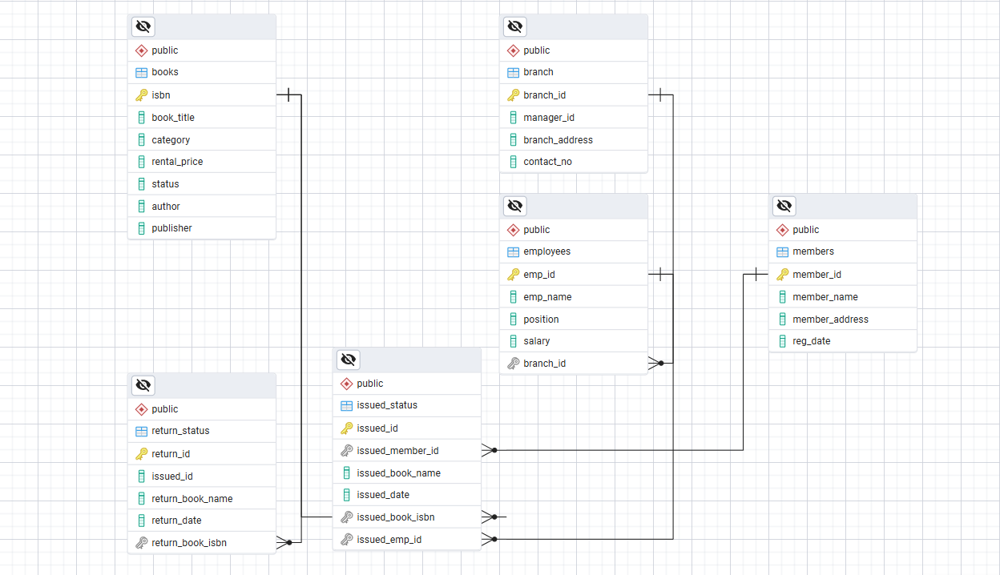

# 📚 Practice SQL Queries on Library Management System

## 📌 Project Overview
This project is designed to **practice SQL queries** using a Library Management System (LMS) database.  
It simulates the core operations of a library such as managing **branches, employees, members, books, issuing, and returning of books**.  

The main purpose is to provide a hands-on environment to learn and improve SQL skills including:
- Creating and managing tables
- Inserting, updating, and deleting records
- Writing queries with **joins, subqueries, aggregate functions**

 

## 🏗 Database Schema
The system includes the following tables:

1. **Branch** – Stores branch information (ID, address, contact).
2. **Employees** – Stores employees working at different branches.
3. **Members** – Stores library member details.
4. **Books** – Stores book details including ISBN, title, author, and publisher.
5. **Issued_Status** – Tracks issued books with issue date, member, and employee details.
6. **Return_Status** – Tracks returned books with return date.

## 🏗 Table Relation
 

 ## 🏗 Data visualization and data analysis 
  
